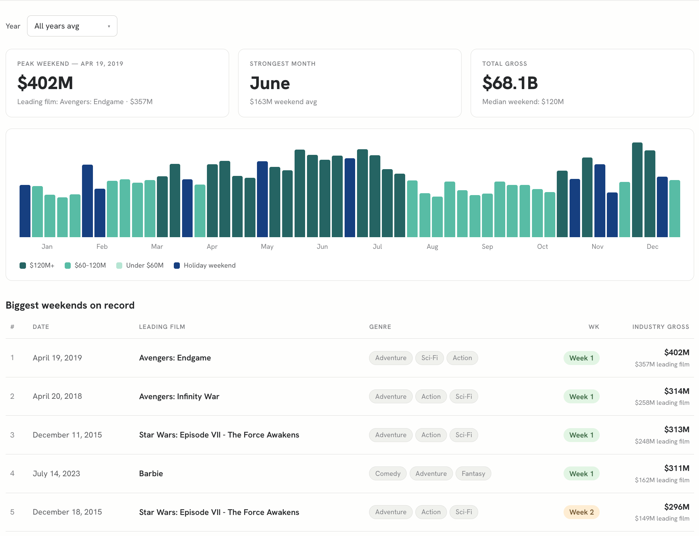
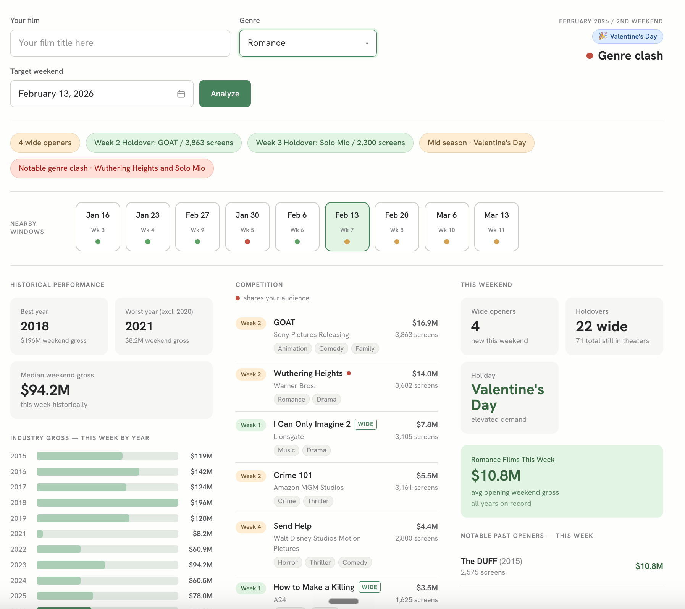
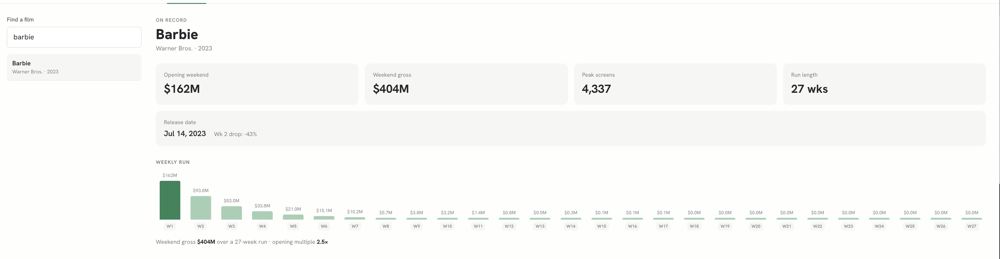

# Slate Setter

A release planning tool for film distributors — pick a weekend, see how crowded it is, and understand what you're up against.

| Industry Dashboard | Release Planner | Film Lookup |
|---|---|---|
|  |  |  |

---

## TL;DR

We want to figure out what weekends gross well historically and what films we're up against to maximize film box office.

Here are our 3 guiding questions:

1. **Is this weekend historically strong?** Some weeks are structurally bigger than others — holidays, summer, awards season. Knowing the baseline before you commit to a date matters.
2. **What are we actually up against?** How many other films are opening, what's still holding screens from last week, is there a same-genre film that just came out and will split the audience.
3. **How have similar films performed in this window before?** If you're releasing a horror film in mid-October, what did the last few horror films do when they opened that same week?

Those questions map directly to the three views in the app. Most of the UI does organize, aggregates, and surfaces relevant scraped data so you can think of the Industry Dashboard and Film Lookup as pretty much pure data visualization. The Release Planner is the one place I built in something more like an algorithm to toy with more of a "recommendation" on "good" weekends.

Every weekend gets scored across six dimensions — wide openers, dominant opener screen count, week 2 holdover screens, week 3 holdover screens, seasonal strength, and genre clash — and each gets a green / amber / red. The dot combines the competitive signals only (seasonal is context, not a threat). One red = red, two ambers = amber, otherwise green. The thresholds came from looking at real weekends and calibrating by feel — they produce sensible results, and the next step would be validating them against actual opening performance data. I wanted to experiment with something a little more opinionated in the product.

**How each signal is evaluated:**

| Signal | Green | Amber | Red |
|--------|-------|-------|-----|
| Wide openers | 0–3 new wide releases | 4–5 | 6+ |
| Dominant opener | < 3,000 screens | 3,000–4,499 | 4,500+ |
| Week 2 holdover | < 4,000 screens | 4,000–4,499 | 4,500+ |
| Week 3 holdover | < 3,500 screens | 3,500–3,999 | 4,000+ |
| Seasonal strength | ≥ 0.95× annual median | 0.70–0.94× | < 0.70× |
| Genre clash | No same-genre film in top 20 | Week 3 rival, < 2,000 screens | Week 1–2 rival, or 2,000+ screens |

The dominant opener signal is new — a single tentpole opening on 4,000+ screens (think Star Wars, Avengers) is a meaningful market force even if it's the only wide opener that weekend. Screen count captures that where headcount alone doesn't.

**Key assumptions baked in:**

- Screen count is a reasonable proxy for competitive threat — a film on 4,300 screens is pulling audience attention and marketing oxygen regardless of its genre
- Week 4+ holdovers are no longer meaningful competition for genre clash — audiences who wanted to see that film have mostly gone by then
- A single amber signal isn't enough to warn against a weekend — you need two independent concerns before the dot turns amber (the 2-amber rule)
- Seasonal strength is informational, not a threat — a slow market week with no competition is still a clean window, just a smaller one
- 2020 is excluded from all historical baselines — COVID makes it an outlier that would distort every average

### Things to try

**Release Planner:**
- Pull up Memorial Day weekend 2025 with Action selected — the holiday lifts the seasonal signal but the opener count might still push it to amber
- Try Horror on the second weekend of October — genre clash will often fire because something horror-adjacent opened the week before
- Compare late August vs. early September for any genre — you can watch the holdover landscape shift as summer films fade
- Try any weekend in January — historically the slowest box office period, but usually light competition, so you'll often get a green dot with a red seasonal pill
- Try the 3rd weekend of July 2026 — no data yet, so only the seasonal pill shows up

**Industry Dashboard:**
- Switch between years and hover the tallest bar to see what led that weekend
- Compare 2023 vs. 2019 — post-COVID recovery vs. the last "normal" pre-COVID year
- Notice 2020 is missing from the all-years average view on purpose — it'd wreck every baseline

**Film Lookup:**
- Search Barbie and Oppenheimer side by side — they opened the same weekend and have completely different hold curves
- Look at any Marvel film vs. a limited-release awards title to see how differently screens drop week over week

---

## Product Requirements

### The problem

Choosing a release date is one of the highest-stakes decisions in distribution. The wrong weekend can mean opening against a dominant holdover, splitting a genre audience, or landing in a historically slow period. Right now this lives in spreadsheets and gut feel (or expensive subscription services). Slate Setter makes it fast and accessible.

### Who it's for

A distribution executive or release planning analyst at a studio or indie distributor. They know their film, they know their genre, they need a fast read on whether a weekend is a smart window.

### The three views

| View | What it does |
|------|-------------|
| **Release Planner** | Per-weekend competitive analysis for a specific film |
| **Industry Dashboard** | Macro box office trends by year and calendar week |
| **Film Lookup** | Week-by-week run data for any film on record |

---

## Data

Data was scraped from three sources and loaded into a Neon PostgreSQL database. Scraper code is in `/scraper`.

**Box Office Mojo** — weekend-by-weekend gross, screen count, market share, and week-in-run for individual films. This is the source for `weekend_entries`. Covers 2015–present; films that opened before 2015 show up with incomplete opening data.

**The Numbers** — total market gross per weekend, stored in `weekends.total_industry_gross`. Scraped separately to capture the full market including films outside the top 10. Also the source for holiday flags and names.

**TMDB** — genre arrays, studio, distributor, wide-release flag, and release date per film. This powers the genre dropdown, clash detection, and the `is_wide` filter that separates wide releases from limited/platform ones.

A few things worth knowing about the data:
- 2020 is excluded everywhere — COVID makes it an outlier that would distort any average
- All figures are Fri–Sun weekend gross, not full domestic lifetime
- Each film stores multiple genres in order of relevance; the first one is treated as primary for clash detection (`genre[0]` in JS, `genre[1]` in SQL because Postgres arrays are 1-indexed)
- Some `release_date` fields from TMDB are wrong (e.g. a re-release year instead of original). The app uses `weeks[0].date` — the first box office entry — for display instead

---

## Engineering

### Stack

| | |
|-|-|
| Framework | Next.js 16.2.7 (App Router) |
| UI | React 19, plain CSS with design tokens |
| Database | PostgreSQL on Neon (`@neondatabase/serverless`) |
| Language | TypeScript 5 |
| Hosting | Vercel |

### Database schema

```
films
  id            uuid PK
  title         text
  studio        text
  distributor   text
  release_date  date          ← nullable; prefer weeks[0].date for display
  is_wide       boolean
  genre         text[]        ← genre[1] in SQL = genre[0] in JS = primary genre

weekends
  id                   uuid PK
  date                 date
  total_industry_gross numeric
  holiday_flag         boolean
  holiday_name         text (nullable)

weekend_entries
  id            uuid PK
  weekend_id    uuid FK → weekends
  film_id       uuid FK → films
  week_in_run   int           ← 1 = opening weekend
  gross         numeric
  screens       int
  market_share  numeric (nullable)
```

### API routes

```
GET /api/weekend/[date]
  All films in market for a Friday date + weekend metadata. Ordered by gross DESC.

GET /api/weekend/[date]/nearby?genre=
  Weekends ±28 days with pre-aggregated signals for calendar dot coloring:
    wide_opener_count    — wide films opening that weekend
    max_week2_screens    — largest screen count among week-2 films
    max_week3_screens    — largest screen count among week-3 films
    direct_rival_count   — wide same-genre films with 1,000+ screens (any week)

GET /api/industry/week/[isoweek]
  All historical weekends for ISO week N across every year on record,
  plus annual median gross.

GET /api/genre/[genre]/week/[isoweek]
  Top 5 films (gross ≥ $5M) that opened in ISO week N for a given genre.

GET /api/industry/calendar?year=all|YYYY
  year=all   → weekly averages across all years (excl. 2020)
  year=YYYY  → actual weekly data for that year
  Returns weekly data, top 5 weekends, strongest month, holiday premium %.

GET /api/genres
  Distinct genre values from the films table.

GET /api/films/search?q=
  Title prefix search.

GET /api/films/[id]/run
  Full weekly run with computed stats (opening gross, wk2 drop %, peak screens, run length).
```

### Key files

```
lib/windowScore.ts         All green/amber/red logic
lib/utils.ts               Date helpers
lib/db.ts                  Neon SQL client
app/planner/page.tsx       Release Planner
app/industry/page.tsx      Industry Dashboard
app/films/page.tsx         Film Lookup
components/CalendarPicker.tsx  Date picker with signal dot overlays
```

---

## Architecture

```
┌──────────────────────────────────────────────────────────────┐
│                        Browser                               │
│                                                              │
│  ┌───────────────┐   ┌─────────────────┐   ┌────────────┐   │
│  │    Planner    │   │    Industry     │   │   Films    │   │
│  │  page.tsx     │   │   page.tsx      │   │  page.tsx  │   │
│  └──────┬────────┘   └────────┬────────┘   └─────┬──────┘   │
│         │                     │                   │          │
│         └─────────────────────┼───────────────────┘          │
│                               ▼                              │
│         ┌─────────────────────────────────────────┐          │
│         │          lib/windowScore.ts              │          │
│         │  WeekendFacts → signals[] → dot + label │          │
│         └─────────────────────────────────────────┘          │
└──────────────────────────┬───────────────────────────────────┘
                           │ fetch()
                           ▼
┌──────────────────────────────────────────────────────────────┐
│                    Next.js API Routes                        │
│                                                              │
│  /api/weekend/[date]           market snapshot              │
│  /api/weekend/[date]/nearby    calendar pre-aggregates      │
│  /api/industry/week/[week]     historical weekly data       │
│  /api/industry/calendar        industry macro view          │
│  /api/genre/[genre]/week/[w]   genre historical openers     │
│  /api/genres                   genre list                   │
│  /api/films/search             title search                 │
│  /api/films/[id]/run           weekly run curve             │
└──────────────────────────┬───────────────────────────────────┘
                           │ @neondatabase/serverless
                           ▼
┌──────────────────────────────────────────────────────────────┐
│                     Neon PostgreSQL                          │
│                                                              │
│   films ──────────────────────────────────────────────────  │
│     id, title, studio, genre text[], is_wide, release_date  │
│          │                                                   │
│          │ FK film_id                                        │
│          ▼                                                   │
│   weekend_entries ────────────────────────────────────────  │
│     week_in_run, gross, screens, market_share               │
│          │                                                   │
│          │ FK weekend_id                                     │
│          ▼                                                   │
│   weekends ───────────────────────────────────────────────  │
│     date, total_industry_gross, holiday_flag, holiday_name  │
└──────────────────────────────────────────────────────────────┘
```

---

## Signal System

All the logic lives in `lib/windowScore.ts`. Each weekend gets six signal pills, and they combine into a single dot.

### Wide Openers + Dominant Opener

| Condition | Signal |
|-----------|--------|
| 0–3 openers, largest < 3,000 screens | 🟢 Green |
| 4–5 openers, or largest opener 3,000–4,499 screens | 🟡 Amber |
| 6+ openers, or largest opener 4,500+ screens | 🔴 Red |

These two checks are combined into a single competition signal. Any major studio opener hitting 3,000+ screens is meaningful competition — it's pulling audience attention and marketing oxygen even if the opener count is low. A dominant tentpole at 4,500+ screens (Star Wars, Avengers) pushes to red on its own. Hover the pill to see each film's title and screen count.

### Week 2 Holdover

| Screens | Signal |
|---------|--------|
| < 4,000 | 🟢 Green |
| 4,000–4,499 | 🟡 Amber |
| 4,500+ | 🔴 Red |

### Week 3 Holdover

| Screens | Signal |
|---------|--------|
| < 3,500 | 🟢 Green |
| 3,500–3,999 | 🟡 Amber |
| 4,000+ | 🔴 Red |

### Seasonal Strength

Ratio of this week's historical median gross vs. the annual median.

| Ratio | Signal | Label |
|-------|--------|-------|
| ≥ 0.95 | 🟢 Green | Peak season |
| 0.70–0.94 | 🟡 Amber | Mid season |
| < 0.70 | 🔴 Red | Slow season |

Holiday name is appended when present: `Peak season · Memorial Day`. This signal doesn't affect the dot — it's context, not a threat.

### Genre Clash *(only shown when a genre is selected)*

Looks for a same-primary-genre film in the top 20 with 1,000+ screens. Week 4+ holdovers are ignored — by then they're not really splitting audience.

| Condition | Signal |
|-----------|--------|
| No same-genre film in top 20 | 🟢 Green |
| Same-genre film is week 4+ | 🟢 Green |
| Same-genre film in week 3, < 2,000 screens | 🟡 Amber |
| Same-genre film in week 1 or 2 | 🔴 Red |
| Same-genre film with 2,000+ screens (weeks 1–3) | 🔴 Red |

### The dot

```
if no film data yet (future weekend):
  dot = seasonal signal only

threats = [competition, week2, week3, genre]
if any threat is red   → dot = red
if 2+ threats are amber → dot = amber
else                    → dot = green
```

| Dot | Label |
|-----|-------|
| 🟢 | Clean window |
| 🟡 competition | Competitive |
| 🟡 holdover | Active holdover |
| 🟡 genre | Genre overlap |
| 🔴 competition | Packed weekend |
| 🔴 holdover | Strong holdover |
| 🔴 genre | Genre clash |

The calendar dots use the same thresholds and the same 2-amber rule as the main verdict, using pre-aggregated signals so all 9 nearby weekends can render without individual fetches.

---

## Shortcomings & What I'd Do Next

### Data gaps

- **Weekend gross only.** Fri–Sun only, no weekday revenue, no full domestic lifetime.
- **Scraper starts 2015.** Films that opened before 2015 (like Gone Girl) show a $0 opening because only their tail weeks are captured.
- **2020 is excluded.** COVID makes it an outlier — including it would skew every historical average.
- **release_date from TMDB is unreliable.** Some films have re-release dates or null values. The app uses the first box office entry date instead.
- **Genre quality varies.** A few films have wrong primary genres or empty arrays depending on how they were scraped.

### Signal limitations

- **Thresholds are manual.** The green/amber/red cutoffs came from looking at real weekends and calibrating by feel, not statistical modeling. A regression against actual opening performance would be more defensible.
- **Week 4+ dismissal is approximate.** A tentpole in its fourth weekend with 2,500 screens can still be real competition. The screen count check helps but the week cutoff is a blunt instrument.
- **Primary genre only.** A Drama/Thriller opening against a Thriller/Drama won't trigger a clash. Audience overlap is messier than string matching.
- **No scale signal.** A $250M tentpole in week 2 is a different threat than a $20M drama at the same screen count.

### What I'd build next

- **Announced competition for future weekends.** Right now future dates just show historical data. Plugging in announced release schedules would make the planner useful months out.
- **Budget-adjusted thresholds.** If you tell me your target opening, the red/amber/green thresholds could adapt to your scale.
- **Side-by-side weekend comparison.** Analyzing one weekend at a time means a lot of clicking. A two- or three-weekend compare view would speed up the actual planning workflow.
- **Screen velocity.** A film dropping 500 screens per week is less threatening than one holding flat, even at the same current count. Adding a trend line to the holdover signal would improve accuracy.
- **Mobile layout.** Right now it's desktop-only. Most of the actual decision-making probably happens on a phone or tablet.
